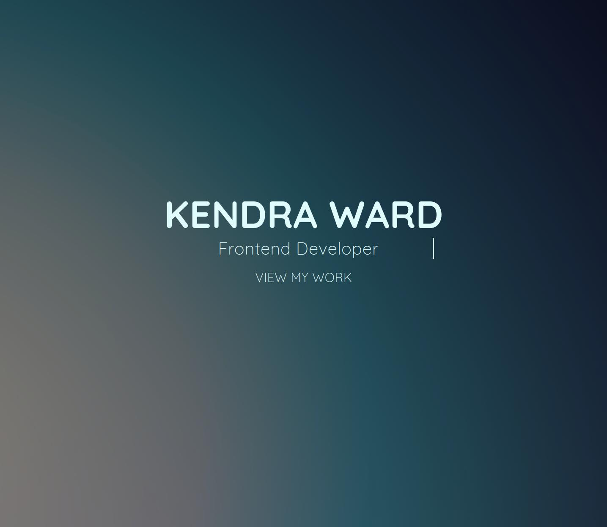
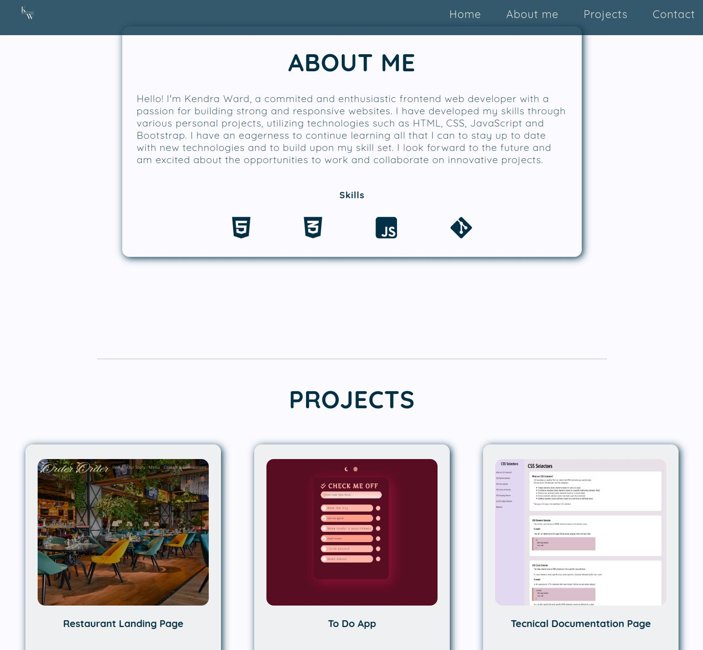

# Personal Front-End Developer Portfolio

## About The Project
This project was built to showcase my front-end developer personal projects. Building my portfolio from scratch gave me the ability to display the technical and web design skills I have learned. I was able to implement JavaScript functions and CSS selectors I was not previously familiar with.
- Portfolio will be frequently updated with new projects.

### Built With
* HTML
* CSS
* JavaScript

## Acknowledgements
* [W3 Schools](https://www.w3schools.com/)
* [Font Awesome](https://fontawesome.com/)
* [Google Fonts](https://fonts.google.com/)
* [Pexels- free stock photos](https://www.pexels.com/)

## Author
- Kendra Ward - [@KNWard](https://github.com/KNWard)